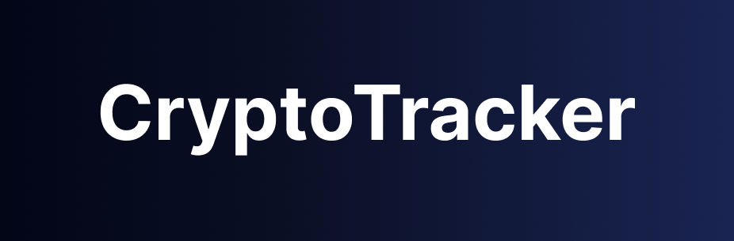

<h1 align="center">
  
</h1>

<p align="center">
  
</p>


## 💻 Projeto
Crypto Tracker é um aplicativo em React Native que permite adicionar criptomoedas, visualizar o preço atual e a variação percentual das últimas 24 horas, além de remover moedas da sua lista. Mantenha-se atualizado e gerencie seu portfólio de cripto de forma simples e intuitiva! 🪙💱


## 📝 Features 

-   [x] Integração com a API da CoinGecko para listar as principais criptomoedas.
-   [x] Exibe o valor atual de mercado de cada criptomoeda e sua variação nas últimas 24 horas.
-   [x] Permite adicionar criptomoedas favoritas à uma lista personalizada.
-   [x] Exibe o saldo total com base nas criptomoedas favoritas e suas cotações.
-   [x] Oferece gráficos de desempenho para cada moeda utilizando dados da API da CoinGecko.
-   [x] Interface com experiência de usuário limpa e responsiva.


## ✨ Tecnologias

-   [x] React Native
-   [x] Typescript
-   [x] Expo
-   [x] Zustand
-   [x] Async Storage
-   [x] Vector Icons
-   [x] Axios
-   [x] Expo Google Fonts
-   [x] Expo Navigation
-   [x] Expo Navigation Stack
-   [x] TailwindCSS


## 🔖 Layout

Você pode visualizar o layout do projeto através [desse link](https://www.figma.com/design/AexClQSFOXlUZoEKvOj9jl/Crypto-Tracker?node-id=10414-140&t=Rpy8lpOBO1InmWIu-1). É necessário ter conta no [Figma](http://figma.com/) para acessá-lo.


## 💻 Executando o projeto

Utilize o **yarn** ou o **npm install** para instalar as dependências do projeto.
Em seguida, inicie o projeto.

```cl
expo start
```

## 📄 Licença

Esse projeto está sob a licença MIT. Veja o arquivo [LICENSE](LICENSE.md) para mais detalhes.

<br />

<div align="center">
  <small>Desenvolvido por Douglas Henrique Faria Silva - Setembro/2024<br /><br /></small>

  [](https://www.linkedin.com/in/hfsdouglas/) 
</div>